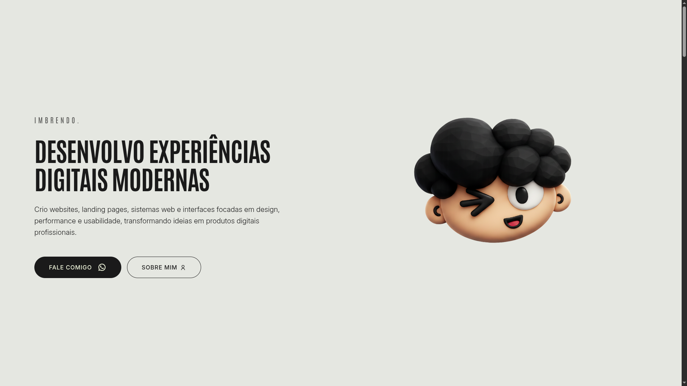

<h1 align="center">imBrendodev</h1>

  <em>Full-Stack Developer Portfolio</em>

  
  

---

## 📌 Sobre

Este é meu portfólio pessoal desenvolvido para apresentar:

- Projetos autorais  
- Habilidades técnicas  
- Experiência com desenvolvimento frontend  
- Identidade visual e estilo de código  

O objetivo é unir performance, organização e design moderno em uma aplicação responsiva e profissional.

---

## 🔎 Preview

  

---

## 🌐 Acesso

Acesse a versão online: https://imbrendodev.vercel.app/

---

## 🚀 Principais Características

- Design responsivo  
- Estrutura modular  
- Código limpo e organizado  
- Navegação fluida  
- Foco em experiência do usuário  

---

## 🛠 Tecnologias Utilizadas

| Tecnologia   | Finalidade |
|--------------|------------|
| HTML5        | Estrutura semântica |
| CSS3         | Estilização e layout |
| JavaScript   | Interatividade |

---

## 🎯 Objetivo

Criar uma presença digital sólida que represente minhas habilidades técnicas e meu padrão de qualidade como desenvolvedor.

---

## ⭐ Apoie

  Se você gostou do projeto ou ele te ajudou de alguma forma,
  considere deixar uma ⭐ no repositório.

---

  Desenvolvido por <strong>Brendo Reis</strong>

